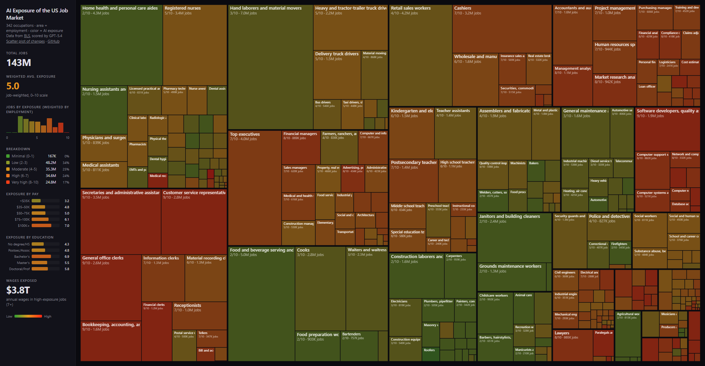

# AI Exposure of the US Job Market

Analyzing how susceptible every occupation in the US economy is to AI and automation, using data from the Bureau of Labor Statistics [Occupational Outlook Handbook](https://www.bls.gov/ooh/) (OOH).

**Live demo: [joshkale.github.io/jobs](https://joshkale.github.io/jobs/)**



## What's here

The BLS OOH covers **342 occupations** spanning every sector of the US economy, with detailed data on job duties, work environment, education requirements, pay, and employment projections. We scraped all of it, scored each occupation's AI exposure using an LLM, and built an interactive treemap visualization.

## Data pipeline

1. **Scrape** (`scrape.py`) - Playwright (non-headless, BLS blocks bots) downloads raw HTML for all 342 occupation pages into `html/`.
2. **Parse** (`parse_detail.py`, `process.py`) - BeautifulSoup converts raw HTML into clean Markdown files in `pages/`.
3. **Tabulate** (`make_csv.py`) - Extracts structured fields (pay, education, job count, growth outlook, SOC code, and each occupation's BLS industry-matrix URL) into `occupations.csv`.
4. **Score** (`score.py`) - Sends each occupation's Markdown description to OpenAI, saves the latest results into `scores.json`, and enriches each score entry with SOC metadata, industry rows, and NAICS industry codes.
5. **Aggregate industries** (`build_industry_exposure.py`) - Converts occupation scores into NAICS-level industry exposure measures using employment-weighted averages across occupations.
6. **Build site data** (`build_site_data.py`) - Merges CSV stats and the latest AI exposure scores into `site/data.json`, and compares `scores_org.json` vs `scores.json` for `site/changes.json`.
7. **Website** (`site/index.html`) - Interactive treemap visualization where area = employment and color = AI exposure (green to red).

## Key files

| File | Description |
|------|-------------|
| `occupations.json` | Master list of 342 occupations with title, URL, category, slug |
| `occupations.csv` | Summary stats plus the BLS employment-by-industry matrix URL |
| `scores_org.json` | Archived original score baseline |
| `scores.json` | Latest canonical AI exposure scores with rationales, industries, and NAICS industry codes |
| `industry_exposure.json` | Employment-weighted AI exposure by NAICS code with top occupation contributors |
| `industry_exposure.csv` | Flat industry exposure table for spreadsheets and analysis |
| `html/` | Raw HTML pages from BLS (source of truth, ~40MB) |
| `pages/` | Clean Markdown versions of each occupation page |
| `site/` | Static website (treemap visualization) |

## AI exposure scoring

Each occupation is scored on a single **AI Exposure** axis from 0 to 10, measuring how much AI will reshape that occupation. The score considers both direct automation (AI doing the work) and indirect effects (AI making workers so productive that fewer are needed).

A key signal is whether the job's work product is fundamentally digital - if the job can be done entirely from a home office on a computer, AI exposure is inherently high. Conversely, jobs requiring physical presence, manual skill, or real-time human interaction have a natural barrier.

**Calibration examples from the dataset:**

| Score | Meaning | Examples |
|-------|---------|---------|
| 0-1 | Minimal | Roofers, janitors, construction laborers |
| 2-3 | Low | Electricians, plumbers, nurses aides, firefighters |
| 4-5 | Moderate | Registered nurses, retail workers, physicians |
| 6-7 | High | Teachers, managers, accountants, engineers |
| 8-9 | Very high | Software developers, paralegals, data analysts, editors |
| 10 | Maximum | Medical transcriptionists |

Average exposure across all 342 occupations: **5.3/10**.

## Industry exposure

Industry exposure is derived from the occupation scores using each occupation's
employment inside a NAICS industry as the weight:

```text
industry exposure =
  sum(occupation exposure * occupation jobs in industry)
  / sum(occupation jobs in industry)
```

The resulting `industry_exposure.*` files are based on the occupations covered
by this repository's BLS dataset, so `covered_employment_2024` refers to the
covered occupations rather than a full census of every job in the industry.

## Visualization

The main visualization is an interactive **treemap** where:
- **Area** of each rectangle is proportional to employment (number of jobs)
- **Color** indicates AI exposure on a green (safe) to red (exposed) scale
- **Layout** groups occupations by BLS category
- **Hover** shows detailed tooltip with pay, jobs, outlook, education, exposure score, and LLM rationale

## Setup

```bash
uv sync
uv run playwright install chromium
```

Requires an OpenAI API key in `.env`:

```bash
OPENAI_API_KEY=your_key_here
```

## Usage

```bash
# Scrape BLS pages (only needed once, results are cached in html/)
uv run python scrape.py

# Generate Markdown from HTML
uv run python process.py

# Generate CSV summary
uv run python make_csv.py

# Score AI exposure and overwrite the latest canonical scores file
uv run python score.py

# Build industry exposure files from the occupation scores
uv run python build_industry_exposure.py

# Build website data and baseline-vs-latest comparison data
uv run python build_site_data.py

# Serve the site locally
cd site && python -m http.server 8000
```
